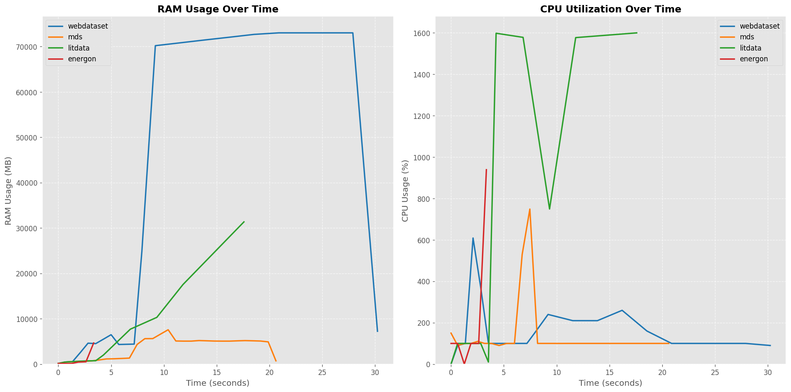
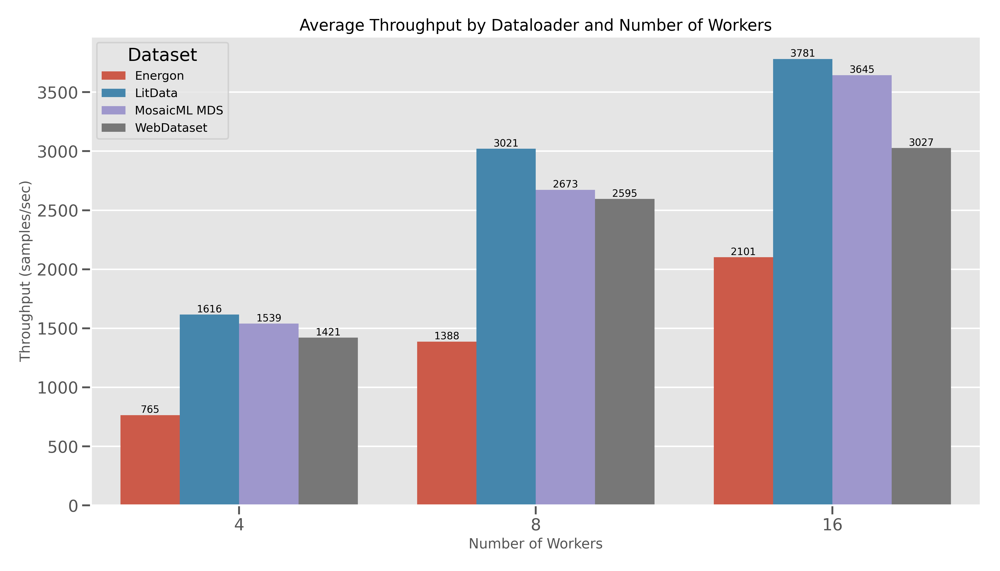
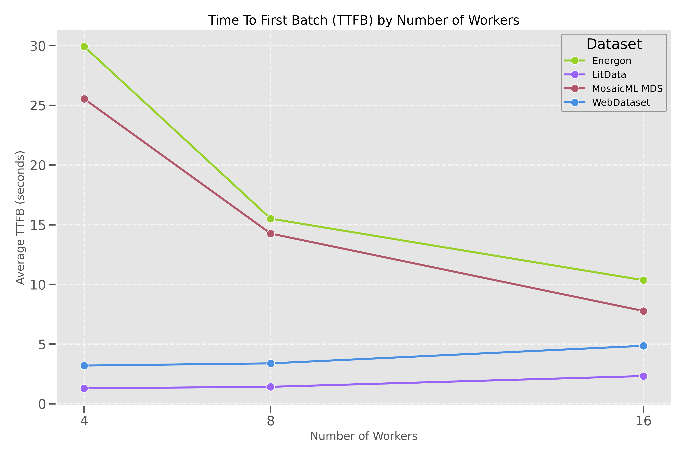

# Benchmark Multimodal Dataloaders

Benchmarking inspired by [Lightning AI Blogpost](https://lightning.ai/lightning-ai/studios/benchmark-cloud-data-loading-libraries?view=public&section=featured&tab=overview) originally benchmarking using the ImageNet Dataset

## Setup

1. Clone this repository with submodules: 
```bash
git clone --recurse-submodules https://github.com/Nano1337/benchmark-dataloader.git
```

2. We use `uv` as dependency management for this project. Please see installation instructions in [here](https://docs.astral.sh/uv/getting-started/installation/). Once installed, please run:
```bash
uv sync
source .venv/bin/activate
```

3. We will need to install `litData` as a module: 
```bash
cd litData
uv pip install -e .
cd ..
```

## Data

We will be using a random 88513 sample shard from DataComp (~3GB) that's been uploaded to HuggingFace. To download the data: 

1. Install git lfs
```bash
sudo apt update 
sudo apt install git-lfs
git lfs install
```
2. Download the data from HuggingFace: 
```bash
mkdir -p data
cd data
git clone https://huggingface.co/datasets/Nano1337/benchmark_dataset
mv benchmark_dataset/ benchmark_dataset.parquet/
```


The parquet dataset here has the following columns: 
```python
Index(['image', 'text'], dtype='object')
```
The `image.content` contains the raw bytes of the image while `text.content` contains the corresponding caption in text characters.


## Benchmarking

### Data Preparation

1. Run `python prepare_datasets.py --sweep --profile` to run the dataset preparation benchmarking. The output datasets will be found in `./shards`. You can view the resource usage plots in `./results/processing/plots`.

2. Please upload `./shards` to your respective cloud storage provider. Here's an example for s3: 
```bash
aws s3 cp ./shards s3://<your-bucket>/shards --recursive
```

3. Please update the `S3_BENCHMARK_DATA_PATH` in your `.env` to the s3 path of the dataset you want to benchmark streaming with in the next section. 

Note that we benchmark only using 3GB worth of data for dataset preparation (representing potentially one data shard in the worst case) as the RAM overhead growth is not linear in some cases (e.g. LitData) but can be easily scaled up using spark distributed data processing. 

Running on 16 CPUs:

| Format | Total Time (s) | Dataset Write (s) | Size (GB) | # Files | Peak RAM (MB) |
| --- | --- | --- | --- | --- | --- |
| LitData (PL) | 34.72 | 30.16 | 2.78 | 60 | 32913.5 |
| WebDataset (WDS) | 31.03 | 24.51 | 3.17 | 23 | 73030.6 |
| MosaicML Dataset (MDS) | 21.14 | 12.90 | 2.86 | 47 | 7575.9 |
| Energon (WDS+) | 37.70 | 49.02 | 3.18 | 51 | 73030.6 |

We can also see the RAM and CPU utilization profiling results in `results/processing/plots`. An example on 16 workers: 



Here's a summary of sweeping across different num workers: 

LITDATA RESULTS:
| Workers | Total Time (s) | Dataset Write (s) | Peak RAM (MB) |
| --- | --- | --- | --- |
| 1 | 34.40 | 29.82 | 3439.2 |
| 2 | 24.35 | 19.80 | 6171.2 |
| 4 | 21.50 | 16.89 | 11390.6 |
| 8 | 24.08 | 19.54 | 19943.6 |
| 16 | 34.72 | 30.16 | 32913.5 |

WEBDATASET RESULTS:
| Workers | Total Time (s) | Dataset Write (s) | Peak RAM (MB) |
| --- | --- | --- | --- |
| 1 | 22.97 | 16.66 | 6413.8 |
| 2 | 29.90 | 23.41 | 15389.6 |
| 4 | 30.19 | 23.69 | 23385.4 |
| 8 | 30.53 | 24.03 | 39262.1 |
| 16 | 31.03 | 24.51 | 73030.6 |

MDS RESULTS:
| Workers | Total Time (s) | Dataset Write (s) | Peak RAM (MB) |
| --- | --- | --- | --- |
| 1 | 20.98 | 12.80 | 7657.3 |
| 2 | 21.08 | 12.91 | 7570.0 |
| 4 | 21.10 | 12.91 | 7513.1 |
| 8 | 21.04 | 12.90 | 7609.8 |
| 16 | 21.14 | 12.90 | 7575.9 |

ENERGON RESULTS:
| Workers | Total Time (s) | Dataset Write (s) | Peak RAM (MB) |
| --- | --- | --- | --- |
| 1 | 6.57 | 16.66 | 4610.2 |
| 2 | 6.73 | 23.41 | 4615.1 |
| 4 | 7.77 | 23.69 | 4661.0 |
| 8 | 7.54 | 24.03 | 4731.2 |
| 16 | 6.68 | 24.51 | 4657.8 |

### Streaming

1. To run streaming benchmarks, please set the env var `S3_BENCHMARK_DATA_PATH` to the s3 path of the dataset you want to benchmark containing directories `webdataset`, `mds`, `litdata`, and `energon`. 

2. Set the env var `MSC_CONFIG` to the path of the MSC config file.

3. Then, run `python stream_datasets.py`. You can also run a sweep by adding the `--sweep` flag, which is resumable. 

Results: 

One example configuration: Batch Size = 256, Workers = 8, Prefetch Factor = 2

| Dataset | Throughput (img/s) | Time to First Batch (s) | # Samples | Wall Time (s) |
| --- | --- | --- | --- | --- |
| WebDataset | 2614.48 | 3.10 | 177028 | 79.31 |
| MosaicML MDS | 2642.40 | 16.96 | 177028 | 88.38 |
| LitData | 3040.25 | 0.98 | 177028 | 63.63 |
| Energon | 1432.81 | 18.83 | 177152 | 148.51 |

Relevant plots: 



FAQ:
1. `ValueError: Profile s3-iad-webdataset not found; available profiles: ['default']`. You should set `MSC_CONFIG` env var to the path of the MSC config file.